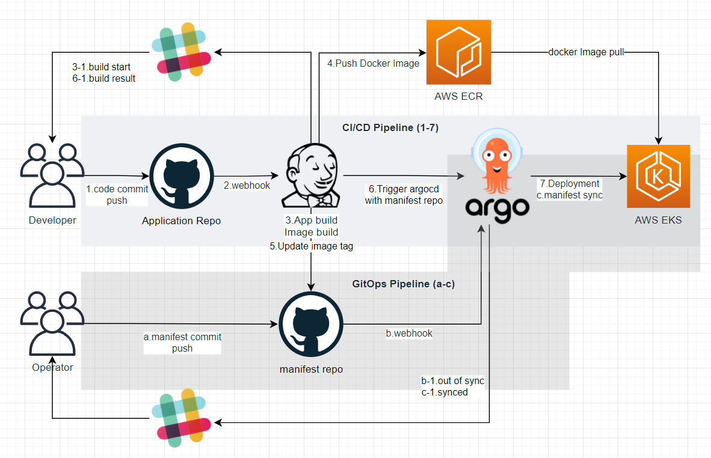
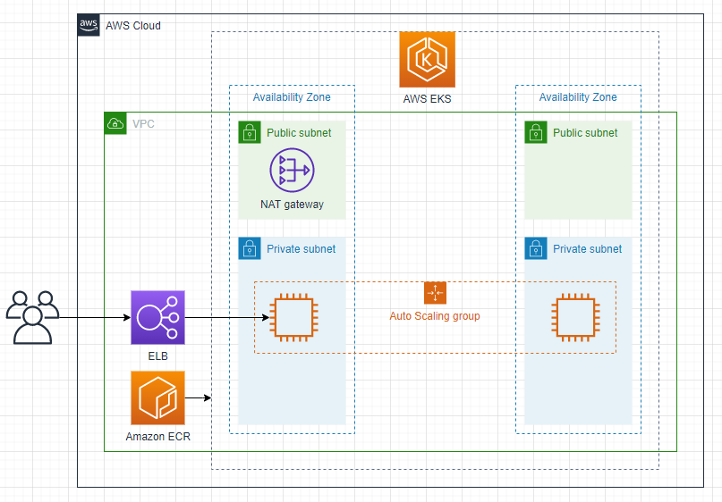
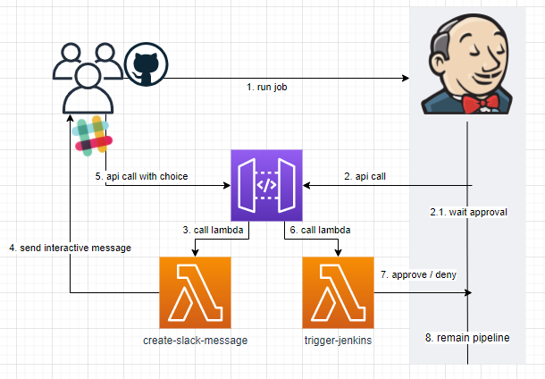

# CI/CD Pipeline on EKS
> 2021년 3월중순 ~ 5월중순
> DevOps팀 OJT(on the job training) 발표를 위한 개인 프로젝트

## 개요
 AWS EKS 위에 컨테이너 기반 파이프라인 구축   
 파이프라인 알림과 제어기능 구현   

## Architecture

## 내용
- 인프라 플랫폼으로 AWS EKS를 사용
   - eksctl을 사용하여 구축
- EKS위에 Jenkins와 ArgoCD를 배포하여 사용
   - Jenkins는 helm으로 배포
   - ArgoCD는 kubectl로 배포
- 이미지는 AWS ECR에 저장
- Github - Jenkins - ArgoCD로 파이프라인을 구축
- 파이프라인 동작과정은 Slack으로 알림 기능을 구현
- 파이프라인 제어는 AWS Lambda와 API Gateway, Slack으로 구현
